# Data Tagging Guidelines (Standardization) for Logbook ATA Chapters

## Overview   
This page outlines a set of rules to use when annotating data for Condition, Component, Location, Result, and Action entities for use within Tetrachrome and the overall Information Exraction project (CMU and Boeing). This document attempts to make clear rules which should be applied given ambiguous tagging situations.

### Entity Descriptions
**Component:** A part of the airplane.  
**Location:** A location within the airplane, specific enough to generally get you within arm's length of a Condition or Component. Also, directional information which disambiguates one Component from another or helps to identify it(them) specifically.     
**Condition:** A specific situation which has occurred or is occurring with regards to a Component or Location.
**Action:** A task which is/was carried out to attempt to resolve the Condition present in the record.  
**Result:** The outcome of an Action.  

### Intuition

Example:   
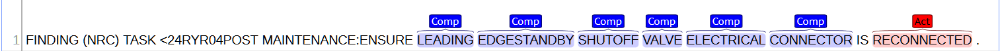   
The above example can be thought of in two main ways and occurs frequently.   
SUBJECT TEXT: "LEADING EDGESTANDBY SHUTOFF VALVE ELECTRICAL CONNECTOR"    
 
Component: "LEADING EDGESTANDBY SHUTOFF VALVE ELECTRICAL CONNECTOR"    
Location: ""   

Example:   
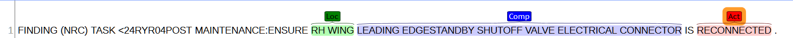     
SUBJECT TEXT: "RH WING LEADING EDGESTANDBY SHUTOFF VALVE ELECTRICAL CONNECTOR"   
 
Component: "LEADING EDGESTANDBY SHUTOFF VALVE ELECTRICAL CONNECTOR"    
Location: "RH WING"   
 

### Examples   

#### DISC_CMPLNT_TX (Logbook complaint text entries)  
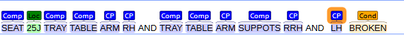  
Application of Guideline 7. RH, RRH, and LH are not tagged as they are considered sub-Compoent level location information. 25J is annotated as Location in application of Guideline  6, 3, and 4.
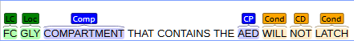  
Location information preceding a Component.
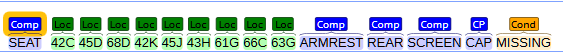  
Multiple individual SEAT Locations.
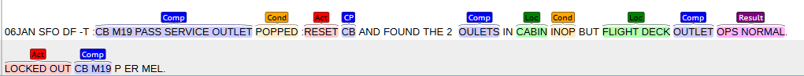  
M19 is not sufficient data to locate the Circuit Breaker being referenced so is annotated as Component.
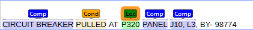  
P320 is the location of a specific Panel, J10 and L3 are the locational information of the sub-Component CIRCUIT BREAKER so is annotated as Component.
  
#### MAINT_ACT_TX (Logbook maintenance action text entries)  
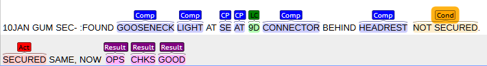  
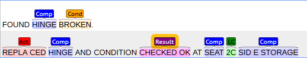  
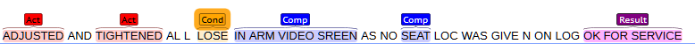  
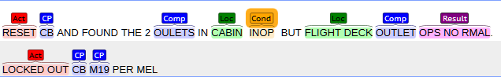  
  
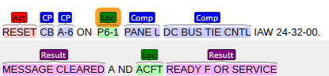  
